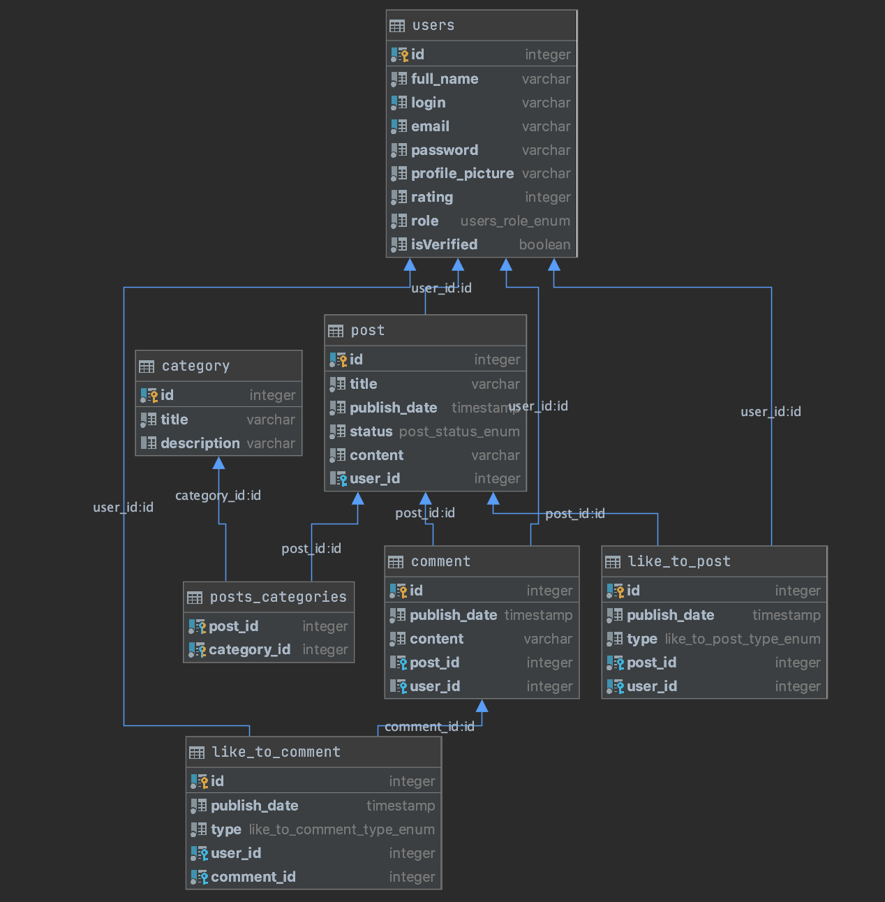

# USOF REST API

Do you know something about stack overflow ?🙈<br> 
I'm sure you do. So this is my custom interpretation.⬇️⬇️⬇️

## Technologies

- ### Back end

    - [Koa](https://koajs.com/)- Nodejs framwork for building the REST Apis
    - [Koa-router](https://www.npmjs.com/package/koa-router)- for routing
    - [Typescript](https://www.typescriptlang.org)- for static language
    - [Nodemailer](https://nodemailer.com)- for mail
    - [Koa-body](https://koajs.com)- for post routes
    - [@koa/cors](https://www.npmjs.com/package/@koa/cors)- to enable Enable Cross-Origin Requests
    - [Typeorm](https://typeorm.io/#/)- for good sql structure
    - [PostgreSQL](https://www.postgresql.org/)- SQL database
    - [Argon2](https://github.com/ranisalt/node-argon2#readme)- hash password
    - [joi](https://github.com/hapijs/joi#readme)- js validation
    - [Koa-multer](https://www.npmjs.com/package/multer)- for uploading images
    - [Jsonwebtoken](https://github.com/auth0/node-jsonwebtoken#readme)- authorization with tokens
    - [ESLint](https://eslint.org/)- for good style codding
    - [Prettier](https://prettier.io/)- for good style codding

## ☑ TODO
##**Authentication entity**:<br/>

- [x] GET - /api/auth/verify-email/<confirm_token> - sets the confirmed status to user in database
- [x] POST - /api/auth/register - registration of a new user, required parameters are [login, password, password confirmation, email]<br/>
- [x] POST - /api/auth/login - log in user, required parameters are [login, password]. Only users with a confirmed email can sign in<br/>
- [x] POST - /api/auth/logout - log out authorized user<br/>
- [x] POST - /api/auth/password-reset - send a reset link to user email, required parameter is [email]<br/>
- [x] POST - /api/auth/password-reset/<confirm_token> - confirm a new password with a token from email, required parameter is a [new password]<br/>

##**User entity**:<br/>

- [x] GET - /api/users - get all users<br/>
- [x] GET - /api/users/<user_id> - get specified user data<br/>
- [x] POST - /api/users - create a new user, required parameters are [login, password, password confirmation, email, role]. This feature must be accessible only for admins<br/>
- [x] POST - /api/users/avatar - let an authorized user upload his/her avatar. The user will be designated by his/her access token<br/>
- [x] PATCH - /api/users/<user_id> - update user data<br/>
- [x] DELETE - /api/users/<user_id> - delete user<br/>

##**Post entity**:<br/>

- [x] GET - /api/posts- get all posts.This endpoint doesn't require any role, it is public. If there are too many posts, you must implement pagination. Page size isup to you<br/>
- [x] GET - /api/posts/<post_id> - get specified post data.Endpoint is public<br/>
- [x] GET - /api/posts/<post_id>/comments - get all comments for the specified post.Endpoint is public<br/>
- [x] POST - /api/posts/<post_id>/comments - create a new comment, required parameter is [content, author]<br/>
- [x] GET - /api/posts/<post_id>/categories - get all categories associated with the specified post<br/>
- [x] GET - /api/posts/<post_id>/like - get all likes under the specified post<br/>
- [x] POST - /api/posts/- create a new post, required parameters are [title, content, categories, author]<br/>
- [x] POST - /api/posts/<post_id>/like - create a new like under a post<br/>
- [x] PATCH - /api/posts/<post_id> - update the specified post (its title, body or category). It's accessible only for the creator of the post<br/>
- [x] DELETE - /api/posts/<post_id> - delete a post<br/>
- [x] DELETE - /api/posts/<post_id>/like - delete a like under a post<br/>

##**Categories entity**:<br/>

- [x] GET - /api/categories- get all categories<br/>
- [x] GET - /api/categories/<category_id> - get specified category data<br/>
- [x] GET - /api/categories/<category_id>/posts - get all posts associated with the specified category<br/>
- [x] POST - /api/categories - create a new category, required parameter is [title]<br/>
- [x] PATCH - /api/categories/<category_id> - update specified category data<br/>
- [x] DELETE - /api/categories/<category_id> - delete a category<br/>

##**Comments entity**:<br/>

- [x] GET - /api/comments/<comment_id> - get specified comment data<br/>
- [x] GET - /api/comments/<comment_id>/like - get all likes under the specified comment<br/>
- [x] POST - /api/comments/<comment_id>/like - create a new like under a comment<br/>
- [x] PATCH - /api/comments/<comment_id> - update specified comment data<br/>
- [x] DELETE - /api/comments/<comment_id> - delete a comment<br/>
- [x] DELETE - /api/comments/<comment_id>/like - delete a like under a comment<br/>

##**Database tables**:<br/>

- Users<br/>
- Posts<br/>
- Comments<br/>
- Categories<br/>
- Likes<br/>
- posts_categories<br/>

</img>

#installation for mac users:

- Before start, you need to install PostgreSQL

```md
> brew install postgresql
```

- Then start the server:

```md
> brew services start postgresql 
```

- Then in sql console write this:

```md
> CREATE DATABASE usof; 
```

#usage:

```md
> npm run start
```

- or for development 

```md
> npm run dev
```


## License

MIT
